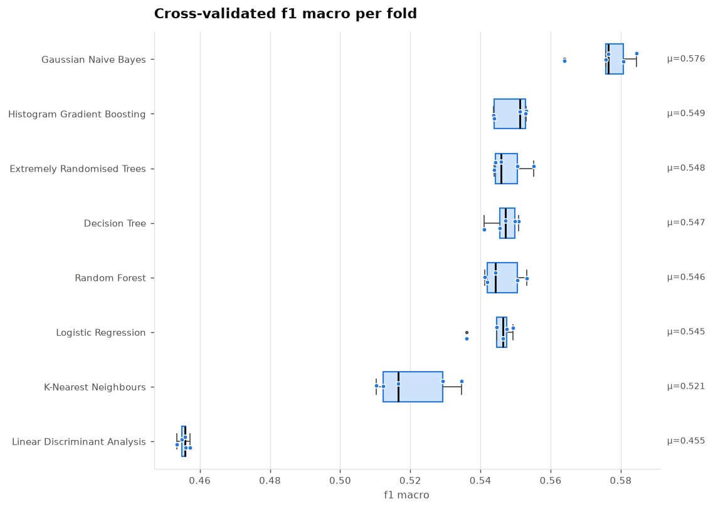
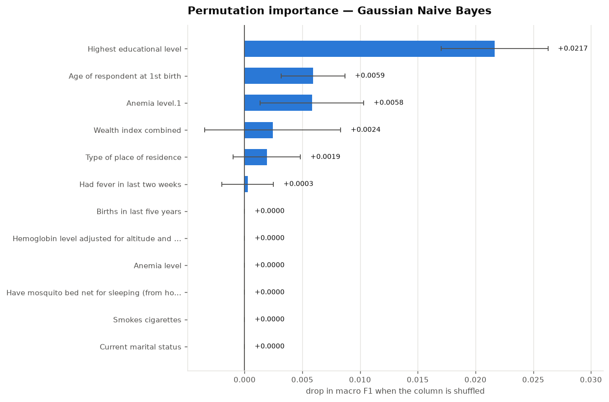

# autoclf — an automated, leakage-free classification pipeline

**M.Tech course project · Department of Computer Science, IIT Hyderabad**

A command-line tool that takes an arbitrary tabular CSV and produces a
validated classification experiment: preprocessing, feature selection, model
benchmarking, cross-validated metrics, statistical model comparison and a
publication-ready PDF report — from a single reproducible configuration.

```bash
python main.py --dataset dataset.csv --all-models --tune
```

---

## Abstract

Building a classifier is easy; producing an accuracy figure that survives
contact with new data is not. The common failure is not a bad model but a
*leaky evaluation*: a scaler, an imputer or a feature ranking fitted on the
whole dataset before the folds are drawn, so every reported score is quietly
optimistic. `autoclf` makes that mistake structurally impossible — every
data-dependent transformation lives inside a scikit-learn `Pipeline` and is
refitted from scratch on each training fold — and reports the metrics that
remain informative when classes are imbalanced. On the bundled demographic
health survey (30,548 usable records, 4.9 : 1 class ratio), the tool shows why
this matters: the model with the *highest accuracy* in the benchmark, 83.0%, is
the one that learned nothing at all.

## Contents

- [What it does](#what-it-does)
- [Why it exists](#why-it-exists-the-problem-with-v1)
- [Architecture](#architecture)
- [Installation](#installation)
- [Usage](#usage)
- [Output](#output)
- [Results on the bundled dataset](#results-on-the-bundled-dataset)
- [Available components](#available-components)
- [Testing](#testing)
- [Repository layout](#repository-layout)
- [Limitations](#limitations)

## What it does

| | |
|---|---|
| **Input** | any CSV with a categorical target column (binary or multi-class) |
| **Handles** | missing values, categorical columns, unseen categories at prediction time, duplicated headers, constant and free-text columns, class imbalance |
| **Search space** | 8 scalers × 9 feature selectors × 7 validation schemes × 11 classifiers |
| **Reports** | accuracy, balanced accuracy, macro precision / recall / F1, MCC, ROC-AUC — per fold, averaged, and on an untouched hold-out set |
| **Explains** | permutation importance on held-out data, with uncertainty |
| **Compares** | paired *t*-test across folds between the best model and each rival |
| **Emits** | `report.pdf`, `plots.pdf`, `results.json`, `summary.csv`, `config.json`, `run.log` |
| **Guarantees** | any run is re-runnable, bit-for-bit, from the `config.json` it wrote |

## Why it exists: the problem with v1

The first version of this project (December 2023) was a single 154-line script
with four interactive helper modules. It worked, and its accuracy numbers were
not trustworthy. Three defects, all of them common in coursework and in
published work:

```python
# v1 — normalization.py
normalized_df   = scaler.fit_transform(df1)   # train
normalized_df_b = scaler.fit_transform(df2)   # hold-out, refitted from scratch
```

1. **The hold-out set was transformed by its own separately fitted scaler**, so
   feature *k* of the test matrix no longer denoted the same quantity as feature
   *k* of the training matrix. The same pattern appeared in the feature selector,
   where a fresh selector was fitted on the hold-out set and its output — a
   matrix of features — was returned in the variable named `y`.
2. **Scaling and selection happened once, before cross-validation.** Each fold's
   validation rows had therefore already shaped the transform applied to the
   training rows, biasing every fold score upwards.
3. **Only accuracy was reported**, on a target with a 4.9 : 1 class ratio, where
   a constant prediction scores 83%.

Everything else in the rewrite — the registries, the CLI, the report, the tests
— follows from fixing those three things properly rather than patching them.
The user-facing behaviour is deliberately preserved: `python main.py` with no
arguments still walks through the same guided menus.

## Architecture

```
                 ┌──────────────┐
   dataset.csv ─►│  data.py     │  load · clean · encode label · stratified hold-out split
                 └──────┬───────┘
                        │  Dataset(X_train, X_test, y_train, y_test, schema)
                        ▼
   RunConfig ─────►┌──────────────┐
   (config.py)     │ pipeline.py  │  assemble one sklearn Pipeline per model
                   └──────┬───────┘
                          │
        ┌─────────────────┴─────────────────────────────────┐
        │   prep   →   scale   →   select   →   clf         │  ◄── refitted inside
        │  impute      8 options   9 options   11 options    │      every CV fold
        │  + one-hot                                         │
        └─────────────────┬─────────────────────────────────┘
                          ▼
                   ┌──────────────┐
                   │ evaluate.py  │  k-fold CV · optional nested grid search
                   └──────┬───────┘  hold-out scoring · permutation importance
                          │                paired t-test between models
                          ▼
                   ┌──────────────┐
                   │  report.py   │  report.pdf · plots.pdf · results.json · summary.csv
                   │  plots.py    │
                   └──────────────┘
```

The registries (`preprocessing.py`, `feature_selection.py`, `cross_val.py`,
`models.py`) are the four modules of the original project, kept in place and
turned into declarative tables. Adding a technique means adding one row; the
CLI options, the interactive menus, the tests and the report pick it up
automatically.

## Installation

```bash
python -m venv .venv && source .venv/bin/activate
pip install -r requirements.txt
```

Python 3.10+. To install the package and get an `autoclf` command on `PATH`:

```bash
pip install -e ".[dev]"
```

## Usage

**Guided (as in v1) — prompts for each choice:**

```bash
python main.py
```

**Scripted — one model:**

```bash
python main.py --dataset dataset.csv \
               --target "Taking iron pills, sprinkles or syrup" \
               --drop-target-values "Don't know" \
               --scaler robust --selector mutual_info --n-features 25 \
               --models hist_gradient_boosting --cv stratified_kfold --n-splits 10
```

**Benchmark the whole registry with nested hyper-parameter tuning:**

```bash
python main.py --all-models --tune --n-splits 10
```

**Reproduce a previous run exactly:**

```bash
python main.py --config runs/20260922-171555/config.json
```

**See every available component:**

```bash
python main.py --list-options
python main.py --help
```

### Key options

| Flag | Default | Meaning |
|---|---|---|
| `--dataset` | `dataset.csv` | input CSV |
| `--target` | `-1` | target column, by name or index |
| `--drop-target-values` | – | label values to discard, e.g. `"Don't know"` |
| `--holdout-size` | `0.20` | fraction reserved and never trained on |
| `--scaler` / `--selector` / `--cv` | `standard` / `anova` / `stratified_kfold` | pipeline components |
| `--n-features` | `10` | features requested from the selector |
| `--models` / `--all-models` | `random_forest` | one, several, or every classifier |
| `--n-splits` | `5` | cross-validation folds |
| `--tune` | off | grid search *inside* the training folds |
| `--no-class-weight` | – | disable balanced class weights |
| `--random-state` | `42` | the single seed for split, folds and estimators |
| `--n-jobs` | `-1` | parallel workers |
| `--run-name` | timestamp | output directory name |

## Output

Each run writes a self-contained directory:

```
runs/<name>/
├── config.json      the exact configuration — re-run it to reproduce
├── report.pdf       setup · results · statistics · per-class detail · figures
├── plots.pdf        the figures on their own
├── results.json     every per-fold score, plus Python/sklearn versions
├── summary.csv      one row per model, for a spreadsheet or a thesis table
├── run.log          full execution log
└── figures/         the individual PNGs
```

## Results on the bundled dataset

`dataset.csv` is a demographic and health survey extract: 33,924 respondents,
17 columns, predicting whether a respondent is **taking iron supplements**.
After dropping unlabelled rows and `"Don't know"` responses, 30,548 records
remain over 4 numeric and 12 categorical features, with a class ratio of
**4.89 : 1** (25,358 No / 5,190 Yes).

Eight classifiers, ANOVA selection of 25 features, standard scaling,
5-fold stratified cross-validation, balanced class weights:

| Model | CV macro F1 | Hold-out F1 | Hold-out accuracy | Balanced acc. | MCC |
|---|---|---|---|---|---|
| Gaussian Naive Bayes | **0.576 ± 0.008** | **0.578** | 0.703 | 0.610 | 0.183 |
| Histogram Gradient Boosting | 0.549 ± 0.005 | 0.541 | 0.605 | **0.636** | 0.205 |
| Extremely Randomised Trees | 0.548 ± 0.005 | 0.547 | 0.639 | 0.605 | 0.163 |
| Decision Tree | 0.547 ± 0.004 | 0.546 | 0.637 | 0.605 | 0.162 |
| Random Forest | 0.546 ± 0.005 | 0.544 | 0.633 | 0.606 | 0.163 |
| Logistic Regression | 0.545 ± 0.005 | 0.546 | 0.612 | 0.637 | **0.207** |
| K-Nearest Neighbours | 0.521 ± 0.011 | 0.534 | 0.799 | 0.533 | 0.095 |
| Linear Discriminant Analysis | 0.455 ± 0.001 | 0.453 | **0.830** | 0.500 | −0.010 |



**How to read this table.** The last row is the point of the whole project.
Linear discriminant analysis has by far the highest accuracy — 83.0%, nineteen
points clear of the best-ranked model — together with a balanced accuracy of
exactly 0.500 and an MCC of −0.010: it predicts "No" for every single respondent
and has learned nothing whatsoever. Nearest neighbours is halfway down the same
road at 0.799. Ranked by accuracy these two lead the table; ranked by any metric
that respects the minority class they come last. Version 1 of this project
reported accuracy only.

The honest conclusion is more modest than any single number suggests: the
signal here is weak. The best macro F1 is 0.58 against a 0.46 floor, the
cross-validation and hold-out columns agree to within 0.01 (so the estimates are
stable and unleaked), and the paired *t*-tests separate Naive Bayes from the
field at *p* < 0.005 — while macro F1 and MCC disagree about second place, which
is itself worth reporting rather than hiding. Socio-economic survey responses
carry real but limited information about supplement uptake; a tool that returned
0.95 here would be lying.



Permutation importance on held-out data concentrates the signal in a handful of
socio-economic columns: **highest educational level** dominates (shuffling it
costs 0.022 macro F1, four times the next column), followed by **age at first
birth**, **anemia level** and **wealth index**. Seven of the twelve inputs move
the score by less than 0.0005 — within their own error bars — which says the
25-feature budget is generous and a much smaller model would do just as well.

## Available components

| Scalers (8) | Feature selectors (9) | Validation (7) | Classifiers (11) |
|---|---|---|---|
| Standard | ANOVA F-test (`SelectKBest`) | Stratified *k*-fold | Random Forest |
| Min–Max | Mutual information | *k*-fold | Extra Trees |
| Robust | F-statistic | Repeated stratified | Histogram Gradient Boosting |
| Normalizer | Variance threshold | Group *k*-fold | Gradient Boosting |
| MaxAbs | Recursive feature elimination | Time-series split | Logistic Regression |
| Power (Yeo–Johnson) | PCA | Shuffle split | SVM (RBF) |
| Quantile | L1 / LASSO | Stratified shuffle split | k-Nearest Neighbours |
| none | Tree importance | | Gaussian Naive Bayes |
| | none | | Decision Tree |
| | | | Linear Discriminant Analysis |
| | | | Neural network (MLP) |

## Testing

```bash
pip install -r requirements-dev.txt
pytest                 # 99 tests, ~6 seconds
ruff check .
```

The suite runs on synthetic data and covers configuration validation, every
registry entry, dataset cleaning edge cases, the metric and comparison logic,
and a full end-to-end run whose artefacts are inspected. Four tests exist
specifically to pin down the v1 defects and keep them from coming back:

| Test | Guards against |
|---|---|
| `test_transformers_learn_from_training_rows_only` | preprocessing fitted on data outside the training fold |
| `test_train_and_test_share_one_feature_space` | transformers refitted separately on the hold-out set |
| `test_preprocessing_is_refit_per_fold` | transformers fitted once, before cross-validation |
| `test_run_is_reproducible_from_its_own_config` | results that cannot be regenerated |

## Repository layout

```
autoclf/
├── __init__.py
├── config.py            RunConfig — the single source of truth, JSON-serialisable
├── data.py              loading, cleaning, schema inference, stratified split
├── preprocessing.py     scaler registry            (was normalization.py)
├── feature_selection.py selector registry          (was feature_selection.py)
├── cross_val.py         validation-scheme registry (was cross_val.py)
├── models.py            classifier registry + grids (was modals.py)
├── pipeline.py          assembles prep → scale → select → clf
├── evaluate.py          cross-validation, hold-out scoring, importance, t-tests
├── plots.py             the figures, in one validated house style
├── report.py            PDF / JSON / CSV artefacts
├── runner.py            orchestration; creates the run directory
├── interactive.py       the guided menu flow from v1
└── cli.py               argument parsing and the console summary
docs/
├── methodology.md       design decisions and the reasoning behind them
└── figures/             figures used by this README
tests/                   99 tests
main.py                  entry point
dataset.csv              bundled demographic health survey extract
```

## Limitations

Stated plainly, because a tool that hides them is the problem it claims to
solve. Grouped and time-ordered data are not properly supported (`group_kfold`
is refused at runtime rather than silently leaking); high-cardinality
categorical columns are dropped by a crude 50-level heuristic instead of being
target-encoded; predicted probabilities are never calibrated; the hold-out
estimate comes from a single split; and class imbalance is handled by
re-weighting only, not resampling. Each is discussed, with the fix it would
need, in [`docs/methodology.md`](docs/methodology.md#6-known-limitations).

## References

1. Kaufman, Rosset & Perlich, *Leakage in data mining: formulation, detection, and avoidance*, ACM TKDD 6(4), 2012.
2. Chicco & Jurman, *The advantages of the Matthews correlation coefficient over F1 and accuracy*, BMC Genomics 21(6), 2020.
3. Varoquaux & Colliot, *Evaluating machine learning models and their diagnostic value*, 2023.
4. Hastie, Tibshirani & Friedman, *The Elements of Statistical Learning*, 2nd ed., Springer, 2009 — Ch. 7.
5. Pedregosa et al., *Scikit-learn: Machine Learning in Python*, JMLR 12, 2011.

## License

MIT — see [LICENSE](LICENSE).
