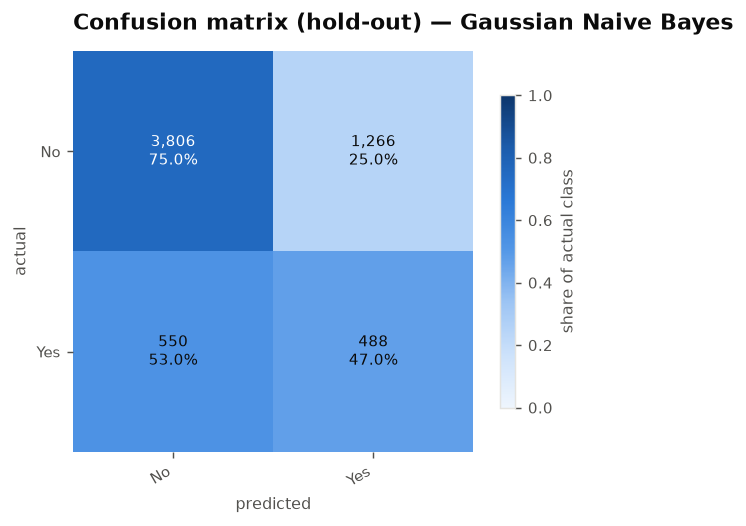

# OmniCLF: An All-in-One, Leakage-Free Pipeline for Tabular Classification

**Technical report · Version 2.0 · September 2026**

---

## Abstract

Automated machine-learning tools are easy to write and easy to get wrong. The
usual failure is not a poorly chosen model but a *leaky evaluation*: a scaler,
an imputer or a feature ranking fitted on the whole dataset before the
validation folds are drawn, so every reported score is quietly optimistic and
nothing in the output reveals it. This report documents OmniCLF, a command-line
tool that turns an arbitrary tabular CSV into a complete, reproducible
classification experiment, and it documents the specific engineering decisions
that make its numbers defensible.

Three properties define the system. First, every data-dependent transformation
is a stage of a single scikit-learn `Pipeline` and is therefore refitted from
scratch inside each training fold, which makes preprocessing leakage
structurally impossible rather than merely discouraged. Second, models are
ranked by macro F1 with balanced accuracy and Matthews' correlation coefficient
reported alongside, because on imbalanced targets plain accuracy rewards
degenerate classifiers. Third, every run writes the configuration that produced
it, so any number in any report can be regenerated with one command.

The tool is evaluated on a demographic and health survey extract of 30,548
records with a 4.89 : 1 class ratio, benchmarking eight classifiers. The result
illustrates the motivation better than any argument: the model with the highest
accuracy in the table, 83.0%, is a degenerate majority-class predictor with a
balanced accuracy of exactly 0.500 and a *negative* MCC. It ranks first by the
metric the previous version of this project reported, and last by every metric
that respects the minority class.

**Contents** · [1. Introduction](#1-introduction) · [2. Background](#2-background-why-reported-accuracy-is-usually-too-high) · [3. Audit of v1](#3-audit-of-the-previous-implementation) · [4. Design](#4-system-design) · [5. Evaluation protocol](#5-evaluation-protocol) · [6. Experimental setup](#6-experimental-setup) · [7. Results](#7-results-and-discussion) · [8. Verification](#8-verification-of-the-implementation) · [9. Limitations](#9-limitations-and-future-work) · [10. Conclusion](#10-conclusion) · [References](#references) · [Appendices](#appendix-a-reproducing-every-number-in-this-report)

---

## 1. Introduction

### 1.1 Problem statement

Given an arbitrary tabular dataset with a categorical target, produce (i) an
unbiased estimate of how well a classifier would perform on data it has never
seen, and (ii) a report a reader can audit without reading the source code.

The emphasis belongs on *unbiased*. A tool that returns optimistic numbers is
worse than no tool at all, because the optimism is invisible in the output: a
leaked accuracy of 0.94 looks exactly like an honest accuracy of 0.94. The
practitioner has no signal that anything is wrong, and the error only surfaces
in production, or in review, or never.

### 1.2 Scope

OmniCLF handles binary and multi-class classification on tabular data of the
size that fits in memory — roughly up to a few hundred thousand rows. It does
not attempt neural architecture search, does not handle images, text or
sequences, and deliberately offers small hyper-parameter grids: the contribution
is methodological correctness, not leaderboard performance.

### 1.3 Design goals

| Goal | How it is met |
|---|---|
| **Correct by construction** | leakage is prevented by the object graph, not by the user remembering to do the right thing |
| **Honest by default** | the default metric respects class imbalance; misleading metrics are shown but never used for ranking |
| **Reproducible** | one seed, one config file, one command to replay |
| **Auditable** | per-fold scores, versions and the full log are written to disk, not just summary means |
| **Extensible** | a new technique is one row in a registry table |
| **Backward compatible** | `python main.py` still runs the original guided menu flow |

---

## 2. Background: why reported accuracy is usually too high

Four failure modes account for most of the gap between reported and realised
performance in applied classification work. The architecture in Section 4 is
arranged to exclude each one.

### 2.1 Preprocessing leakage

Scaling constants, imputation values, encoder vocabularies and feature rankings
are all *learned* from data; they are model parameters wearing a different hat.
If they are learned once from the whole dataset and the data is then split into
folds, each fold's validation rows have already influenced the transformation
applied to its training rows. Information has crossed a boundary that the
evaluation assumes is sealed.

The size of the effect depends on the transformation:

| Transformation | Typical bias | Why |
|---|---|---|
| Centring / scaling | small | two moments estimated from many rows are stable |
| Imputation | small to moderate | grows as missingness grows |
| **Supervised feature selection** | **large** | selecting *k* of *p* features on the full sample can manufacture apparent signal from pure noise when *p ≫ k* |
| Resampling (SMOTE etc.) | large | synthetic training points interpolated from validation rows |

The feature-selection case is the dangerous one, and it is precisely what an
automated tool is most likely to do, because selection is expensive and caching
it outside the fold loop is the obvious optimisation. Hastie et al. devote a
section of *The Elements of Statistical Learning* to exactly this, under the
heading "the wrong way to do cross-validation", and demonstrate a 3% error rate
on data with no signal at all.

### 2.2 Inconsistent feature spaces

A subtler variant, and one that static analysis will not catch: fitting the
transformers *separately* on the training and test matrices.

```python
X_train_scaled = scaler.fit_transform(X_train)
X_test_scaled  = scaler.fit_transform(X_test)   # a second, different scaler
```

Both matrices have the right shape. No exception is raised. Every downstream
call works. But the two scalers learned different means and variances, so
column *k* of the test matrix no longer denotes the same quantity as column *k*
of the training matrix, and the model is being asked to interpret a feature
vector in a coordinate system it was never trained in. The resulting test score
is not biased in a predictable direction — it is simply meaningless. If the
same mistake is made with a *supervised selector*, the two matrices may not even
contain the same features.

### 2.3 Accuracy on an imbalanced target

For a target with prevalence *π* for the majority class, the constant
classifier "always predict the majority" achieves accuracy *π* while learning
nothing. On the dataset used here, *π* = 0.83. Any model reporting accuracy
below 0.83 is, on that metric alone, worse than a single `return` statement —
and any model reporting slightly above it may be doing almost nothing.

Accuracy also hides *which* errors are made, which is usually the decision-
relevant question. Screening for an intervention cares about recall on the
minority class; the majority class is not the point of the exercise.

### 2.4 Reading a difference that is not there

With five folds, a 0.004 difference in mean macro F1 between two models sits
well inside fold-to-fold noise. A table of bare means nonetheless invites the
reader to declare a winner, and the winner will often change if the seed
changes.

---

## 3. Audit of the previous implementation

Version 1 of this project (December 2023) was a 154-line script plus four
interactive helper modules: `normalization.py`, `feature_selection.py`,
`cross_val.py` and `modals.py`. It ran, it produced a PDF, and it exhibited
three of the four failure modes above. The defects are documented here because
the rewrite is organised around them, and because they are ordinary mistakes
rather than exotic ones.

### 3.1 Defect 1 — separately fitted transformers (§2.2)

```python
# v1/normalization.py
def scaling(df1, df2):
    ...
    normalized_df   = scaler.fit_transform(df1)   # training set
    normalized_df_b = scaler.fit_transform(df2)   # hold-out set, refitted
    return normalized_df, normalized_df_b
```

The hold-out set received its own independently fitted scaler. The same pattern
appeared in the selector, with an additional consequence:

```python
# v1/feature_selection.py
X = selector.fit_transform(scaled_data, y)
y = selector.fit_transform(scaled_data_blind, y_blind)   # a feature matrix, named y
return X, y
```

A second selector was fitted on the hold-out set, and because feature ranking
is data-dependent it could select a *different subset of features*. The
variable name `y` for a feature matrix is a symptom of the confusion, not the
cause of it.

### 3.2 Defect 2 — preprocessing outside the fold loop (§2.1)

```python
# v1/main.py
scaled_data, scaled_data_blind = scaling(X, X_blind)
X_reduced, X_reduced_blind     = feature_selection(scaled_data, y, ...)
accuracy_scores = cross_val_score(classifier, X_reduced, y, cv=kf, ...)
```

Scaling and ANOVA-based selection ran *once*, on the whole training set, before
`cross_val_score` drew any folds. Every fold's validation rows had therefore
already participated in choosing which features the model would see.

### 3.3 Defect 3 — accuracy-only reporting (§2.3)

The PDF contained accuracy, macro precision, macro recall and macro F1 per
fold, but the console output, the plots and the narrative were all built around
accuracy, on a target where the constant classifier scores 83%.

### 3.4 Secondary issues

- `X = data.iloc[:, 1:-1]` silently discarded the first column of every dataset.
- `data.fillna(data.mode().iloc[0])` imputed using a mode computed over the
  whole dataset, including the hold-out rows — a third leakage path.
- `pd.factorize` assigned arbitrary integers to nominal categories, imposing a
  false ordering on unordered values such as region names.
- `log_data = X.apply(np.log1p)` was computed and never used; on negative
  inputs it would have produced `NaN` silently.
- Selecting Group *k*-fold crashed, because no grouping vector was ever passed.
- The PDF laid out every string at a hand-computed canvas coordinate, so the
  layout collapsed whenever the number of folds or metrics changed.

### 3.5 What was kept

The rewrite deliberately preserves the parts of v1 that were right: the
four-way decomposition into scaling / selection / validation / model, the menu
of techniques under each, and the guided interactive flow. `python main.py`
with no arguments still asks the same questions in the same order. The registry
tables in Section 4.4 are those menus, promoted from `if/elif` chains to data.

---

## 4. System design

### 4.1 Architecture

```
                 ┌──────────────┐
   dataset.csv ─►│  data.py     │  load · clean · encode label · stratified hold-out split
                 └──────┬───────┘
                        │  Dataset(X_train, X_test, y_train, y_test, schema)
                        ▼
   RunConfig ─────►┌──────────────┐
   (config.py)     │ pipeline.py  │  assemble one sklearn Pipeline per model
                   └──────┬───────┘
                          │
        ┌─────────────────┴──────────────────────────────────┐
        │   prep    →   scale   →   select   →   clf         │  ◄── refitted inside
        │  impute       8 options   9 options   11 options   │      every CV fold
        │  + one-hot                                         │
        └─────────────────┬──────────────────────────────────┘
                          ▼
                   ┌──────────────┐
                   │ evaluate.py  │  k-fold CV · optional nested grid search
                   └──────┬───────┘  hold-out scoring · permutation importance
                          │                paired t-test between models
                          ▼
                   ┌──────────────┐
                   │  report.py   │  report.pdf · plots.pdf · results.json · summary.csv
                   │  plots.py    │
                   └──────────────┘
```

| Module | Responsibility |
|---|---|
| `config.py` | `RunConfig` — the single, JSON-serialisable source of truth |
| `data.py` | loading, cleaning, schema inference, stratified hold-out split |
| `preprocessing.py` | scaler registry (was `normalization.py`) |
| `feature_selection.py` | selector registry |
| `cross_val.py` | validation-scheme registry |
| `models.py` | classifier registry with hyper-parameter grids (was `modals.py`) |
| `pipeline.py` | assembles `prep → scale → select → clf` |
| `evaluate.py` | cross-validation, hold-out scoring, importance, statistical tests |
| `plots.py` | figures, in one validated visual style |
| `report.py` | PDF, JSON and CSV artefacts |
| `runner.py` | orchestration; owns the run directory |
| `interactive.py` | the guided menu flow from v1 |
| `cli.py` | argument parsing and the console summary |

### 4.2 Configuration as the unit of reproducibility

Every experiment is fully described by a `RunConfig` dataclass: dataset path,
target, cleaning rules, the four pipeline choices, validation parameters, seed
and output settings. It validates itself on construction (`holdout_size` in
range, `n_splits ≥ 2`, at least one model), serialises to JSON, and rejects
unknown keys on load so a typo in a hand-edited config fails loudly instead of
being silently ignored.

The run directory is written *before* the experiment starts, and the config
file is the first thing in it. Three consequences follow: a crashed run still
documents what was attempted; `--config runs/<name>/config.json` replays a run
exactly; and the interactive flow is not a separate code path — it simply fills
the same dataclass the CLI flags fill.

### 4.3 The data layer

`data.py` performs only *row-independent* work. Anything that learns a
statistic from the data is deferred to the pipeline, where the fold machinery
can control it. Concretely, the loader:

1. **Disambiguates duplicate headers.** Survey exports repeat column names —
   this dataset has two columns called "Anemia level" — which makes every later
   column selection ambiguous.
2. **Drops rows with no label.** Missing, blank, and any values named by
   `--drop-target-values` (here, `"Don't know"`). A row without supervision
   contributes nothing and, if imputed, contributes noise.
3. **Drops classes too rare to stratify.** Fewer than two rows cannot be split
   across folds.
4. **Encodes the label** to integers, retaining the original names for reports.
5. **Drops unusable columns**: all-missing, constant, or non-numeric with more
   than 50 distinct values (identifiers and free text).
6. **Infers the schema** — numeric versus categorical — and splits off a
   stratified hold-out set.

Note what is *absent*: no imputation, no encoding, no scaling. Those are stages
of the pipeline.

### 4.4 Registries

The four v1 modules became declarative tables mapping a key to a label, a
factory and a one-line rationale:

```python
SCALERS = {
    "robust": ("RobustScaler", lambda: RobustScaler(),
               "median / IQR scaling; preferred when outliers are present"),
    ...
}
```

| Registry | Entries |
|---|---|
| Scalers | Standard, Min–Max, Robust, Normalizer, MaxAbs, Power (Yeo–Johnson), Quantile, none — **8** |
| Selectors | ANOVA F-test, mutual information, F-statistic, variance threshold, RFE, PCA, L1/LASSO, tree importance, none — **9** |
| Validation | stratified *k*-fold, *k*-fold, repeated stratified, group *k*-fold, time-series split, shuffle split, stratified shuffle — **7** |
| Classifiers | Random Forest, Extra Trees, Histogram Gradient Boosting, Gradient Boosting, Logistic Regression, SVM (RBF), *k*-NN, Gaussian NB, Decision Tree, LDA, MLP — **11** |

Adding a technique is one row: the CLI choices, the interactive menu, the
report labels and the parametrised tests all derive from the tables. The
classifier registry additionally carries a small grid per model, keyed
`clf__*` so it can be handed straight to `GridSearchCV` over the pipeline, and
a `_SUPPORTS_CLASS_WEIGHT` set so `class_weight="balanced"` is applied exactly
where the estimator accepts it.

One non-obvious constraint: registry factories must produce *picklable*
estimators, because joblib pickles them to ship to worker processes when
`n_jobs > 1`. The mutual-information selector therefore wraps its scoring
function in `functools.partial` rather than a lambda — a mistake that only
manifests under parallelism, and so is pinned by a test.

### 4.5 The pipeline

```python
Pipeline([
    ("prep",   ColumnTransformer([...])),   # impute + one-hot encode
    ("scale",  build_scaler(config.scaler)),
    ("select", build_selector(config.selector, k, seed)),
    ("clf",    build_model(model_key, seed, balanced)),
])
```

This single object is the fix for §2.1 and §2.2 simultaneously.
`cross_validate` clones it and fits *all four stages* on each training fold, so
no statistic can cross a fold boundary; and because one fitted object serves
both `fit(X_train)` and `transform(X_test)`, train and test necessarily share
one feature space.

Two details in `prep` are worth stating:

- **`SimpleImputer(strategy="median", add_indicator=True)`.** The missingness
  indicator matters on survey data: a blank answer is itself informative — a
  question may not have been asked of that respondent — so discarding the
  pattern throws away signal.
- **`OneHotEncoder(handle_unknown="ignore", min_frequency=0.01)`.** Unknown
  categories at prediction time become an all-zero block instead of raising,
  and rare categories fold into an "infrequent" bucket, which bounds the one-hot
  expansion and stops a category seen twice in training from becoming a
  high-variance dummy.

Because one-hot encoding widens the matrix unpredictably, the requested
`n_features` is clamped to a value the selector can always satisfy, so
`SelectKBest(k=...)` cannot raise on narrow inputs.

### 4.6 Reporting

Artefacts are written to `runs/<name>/`:

| File | Contents |
|---|---|
| `config.json` | the exact configuration; replay it to reproduce |
| `report.pdf` | setup, results, statistics, per-class detail, figures |
| `plots.pdf` | the figures alone |
| `results.json` | every per-fold score, plus Python / platform / scikit-learn versions |
| `summary.csv` | one row per model, for a spreadsheet or a thesis table |
| `run.log` | the full execution log |
| `figures/` | individual PNGs |

The PDF is built from ReportLab *Platypus* flowables rather than absolute
canvas coordinates, so it paginates itself as the number of folds, metrics or
models changes — the v1 layout could not. Figures follow one visual style: a
single accent hue for single-series charts, a fixed categorical order assigned
by entity (never recycled by rank) for multi-series ones, a single-hue
sequential ramp for the confusion matrix, and values printed directly on marks
so that identity and magnitude never depend on colour alone. The categorical
palette was checked programmatically for colour-vision-deficiency separation
(worst adjacent pair ΔE 9.1 against a target of 8) rather than chosen by eye.

---

## 5. Evaluation protocol

1. A **stratified hold-out set** (20% by default) is split off once and is not
   touched again until a final model exists.
2. On the remaining 80%, **stratified *k*-fold cross-validation** produces six
   metrics per fold.
3. The pipeline is **refitted on the full 80%**. Under `--tune`, a grid search
   runs *here*, nested inside the training data, so the hyper-parameter choice
   is also made without sight of the hold-out set.
4. The refitted pipeline is **scored once** on the hold-out set.
5. **Permutation importance** is computed on the hold-out set.

Steps 2 and 4 answer different questions and both are reported. Cross-validation
estimates the *expected* performance of the whole procedure and comes with a
spread across folds; the hold-out score is a single draw from data that
influenced nothing at all. A large gap between them is the signature of
overfitting or of a leak, which is why the report plots them side by side.

**Metrics.** Six are collected per fold: accuracy, balanced accuracy, macro
precision, macro recall, macro F1, and MCC; ROC-AUC is added on the hold-out set
where probabilities are available. Macro F1 is the ranking criterion. MCC earns
its place by being the metric that most clearly exposes a degenerate
classifier — it is near zero for a constant prediction regardless of prevalence,
where accuracy is high and even macro F1 is a non-trivial 0.45.

**Importance.** Each raw input column is shuffled in turn and the loss in macro
F1 recorded, five times, on held-out data. Permutation importance is preferred
to impurity-based importance for three reasons: it is measured on unseen data;
it applies to any estimator, not only trees; and it is expressed in the units of
the metric one actually cares about. Its known weakness — correlated features
share credit, so both may appear unimportant — is why the standard deviation is
reported next to every value. Columns are permuted *before* the encoder, so
attribution is in terms of the original survey questions rather than one-hot
dummies.

**Model comparison.** Because every model sees identical splits, the per-fold
scores are paired, and a paired *t*-test on the differences is the appropriate
test. With five folds it has very little power, so the report states in the text
that a non-significant row means "not distinguishable here", not "equivalent".

**Reproducibility.** One seed threads through the split, the folds, the
estimators and the permutations. `results.json` records the Python, platform
and scikit-learn versions next to the scores.

---

## 6. Experimental setup

`dataset.csv` is a Demographic and Health Survey extract: 33,924 respondents,
17 columns, predicting whether a respondent reports **taking iron pills,
sprinkles or syrup**.

| Property | Value |
|---|---|
| Rows, raw | 33,924 |
| Rows after cleaning | 30,548 (unlabelled and `"Don't know"` rows removed) |
| Train / hold-out | 24,438 / 6,110 |
| Features | 4 numeric, 12 categorical |
| Classes | No (25,358, 83.0%) / Yes (5,190, 17.0%) |
| Imbalance ratio | 4.89 : 1 |

Numeric features are births in the last five years, age at first birth and two
haemoglobin measurements; categorical features cover age group, residence type,
education, wealth index, anaemia level, bed-net ownership, smoking, marital
status, breastfeeding initiation and recent fever.

**Configuration.** Standard scaling, ANOVA selection of 25 features (16 survive
after one-hot expansion for the selected model), 5-fold stratified
cross-validation, balanced class weights where supported, registry-default
hyper-parameters, seed 42. Eight classifiers were benchmarked. Environment:
Python 3.11.16, scikit-learn 1.9.1, Linux x86-64. Cross-validation, refitting
and hold-out scoring across the eight models took 42 seconds in total.

---

## 7. Results and discussion

### 7.1 Benchmark

| Model | CV macro F1 | Hold-out F1 | Accuracy | Balanced acc. | MCC | Fit (s) |
|---|---|---|---|---|---|---|
| Gaussian Naive Bayes | **0.576 ± 0.008** | **0.578** | 0.703 | 0.610 | 0.183 | 1.3 |
| Histogram Gradient Boosting | 0.549 ± 0.005 | 0.541 | 0.605 | 0.636 | 0.205 | 1.9 |
| Extremely Randomised Trees | 0.548 ± 0.005 | 0.547 | 0.639 | 0.605 | 0.163 | 13.1 |
| Decision Tree | 0.547 ± 0.004 | 0.546 | 0.637 | 0.605 | 0.162 | 1.4 |
| Random Forest | 0.546 ± 0.005 | 0.544 | 0.633 | 0.606 | 0.163 | 12.0 |
| Logistic Regression | 0.545 ± 0.005 | 0.546 | 0.612 | **0.637** | **0.207** | 4.1 |
| K-Nearest Neighbours | 0.521 ± 0.011 | 0.534 | 0.799 | 0.533 | 0.095 | 6.5 |
| Linear Discriminant Analysis | 0.455 ± 0.001 | 0.453 | **0.830** | 0.500 | −0.010 | 1.2 |


### 7.2 The accuracy trap, demonstrated

The last row is the point of the entire project. Linear discriminant analysis
posts the **highest accuracy in the table — 83.0%**, nineteen points clear of
the best-ranked model — alongside a balanced accuracy of exactly 0.500 and an
MCC of −0.010. Those two numbers say what accuracy conceals: it predicts "No"
for all 6,110 hold-out respondents and has learned nothing whatsoever. Its
accuracy is precisely the majority-class prevalence, because that is what it is.

*k*-nearest neighbours is halfway down the same road at 0.799 accuracy and 0.533
balanced accuracy: not fully degenerate, but close.

Ranked by accuracy, these two models lead the benchmark. Ranked by any metric
that respects the minority class, they come last. Version 1 of this project
reported accuracy.

### 7.3 What the data actually supports

The honest conclusion is more modest than any single number suggests. The best
macro F1 is 0.576 against a 0.453 floor set by the degenerate classifier — real
signal, but weak. Three further observations:

**The estimates are stable and unleaked.** Cross-validation and hold-out macro
F1 agree to within 0.01 for every model (0.576 → 0.578 for the winner), and the
fold-to-fold standard deviation is 0.004–0.011. A leaking pipeline would
typically show the hold-out column falling well below the cross-validation
column; it does not.

**The ranking is statistically separable at the top.** Paired *t*-tests put
Gaussian Naive Bayes ahead of every rival at *p* < 0.005 (Δ = +0.027 against the
runner-up, *p* = 0.0026). The gaps *between* the six mid-table models, by
contrast, are 0.001–0.003 — noise.

**The metrics disagree about second place, and that is worth reporting.**
Gaussian NB wins macro F1 (0.578) but Logistic Regression has the best MCC
(0.207) and balanced accuracy (0.637). They are making different trade-offs:
NB's confusion matrix on the hold-out set is 3,806 / 1,266 on the majority class
and 550 / 488 on the minority, i.e. it keeps majority-class accuracy high and
catches 47% of the minority; Logistic Regression sacrifices majority accuracy to
catch more. Which is preferable is a deployment question — the cost of a missed
case versus a false alarm — not a modelling one, and the tool's job is to
surface the trade-off rather than to resolve it silently.



### 7.4 Feature importance


Permutation importance concentrates the signal in a handful of socio-economic
columns. **Highest educational level** dominates: shuffling it costs 0.0217
macro F1, roughly four times the next column. **Age at first birth** (0.0059),
**anaemia level** (0.0058) and **wealth index** (0.0024) follow, then
**type of residence** (0.0019).

Seven of the twelve inputs move the score by less than 0.0005 — within their own
error bars, i.e. indistinguishable from noise. This says the 25-feature budget
is generous and a far smaller model would perform identically, which is a more
useful finding than a marginal accuracy gain. The ordering is consistent with
the public-health literature on supplement uptake, where education and
socio-economic status are the dominant determinants.

### 7.5 Interpretation

Socio-economic survey responses carry real but limited information about
supplement uptake. A tool reporting 0.95 on this dataset would be reporting a
leak, not a discovery. The value of the exercise is that the pipeline makes the
weak-signal conclusion *visible and defensible*: the fold spread is small, the
hold-out confirms the cross-validation, the winning margin is significant, and
the importance analysis explains where the little signal there is comes from.

---

## 8. Verification of the implementation

A tool whose selling point is correctness has to demonstrate it. The suite is
**99 tests, running in about six seconds** on synthetic data, plus `ruff` static
analysis; both run clean.

| Area | Coverage |
|---|---|
| Configuration | validation bounds, JSON round-trip, unknown-key rejection |
| Registries | every scaler, selector, splitter and model builds; every grid targets real parameters; estimators pickle (required for `n_jobs > 1`) |
| Data layer | split sizes, stratification, constant / all-missing / high-cardinality / duplicate-header handling, unlabelled-row removal, single-class rejection |
| Evaluation | all metrics collected, signal learned on synthetic data, CV/hold-out agreement, confusion-matrix totals, tuning, importance ranking, paired comparison ordering |
| End to end | every artefact written and non-empty, the PDF is a real PDF, `results.json` is complete, a run reproduces from its own config |
| CLI | flag mapping, `--all-models` expansion, target by name or index, clean exit codes on bad input |

Four tests exist specifically to pin down the v1 defects:

| Test | Guards against |
|---|---|
| `test_transformers_learn_from_training_rows_only` | preprocessing fitted on data outside the training fold (§3.2) |
| `test_train_and_test_share_one_feature_space` | transformers refitted separately on the hold-out set (§3.1) |
| `test_preprocessing_is_refit_per_fold` | transformers fitted once, before cross-validation (§3.2) |
| `test_run_is_reproducible_from_its_own_config` | results that cannot be regenerated |

The first is the interesting one. It fits the pipeline on the training split,
then multiplies every numeric column of the *hold-out* split by 10⁶ and refits;
the transformed training matrices must be bit-identical. If any statistic were
being drawn from outside the training fold, the corruption would propagate and
the assertion would fail.

---

## 9. Limitations and future work

Stated plainly, because a tool that hides its limitations is the problem it
claims to solve.

| Limitation | Consequence | The principled fix |
|---|---|---|
| **Grouped data unsupported** | repeated measurements per subject leak across folds | collect a grouping column and pass it to `GroupKFold`; currently the tool *refuses* group CV at runtime rather than leaking silently |
| **Temporal order unverified** | `time_series` splits assume rows are already in order | require and validate a timestamp column |
| **High-cardinality categoricals dropped** | a crude 50-level heuristic discards possibly useful columns | target or ordinal encoding *inside* the pipeline, cross-fitted to avoid leakage |
| **Probabilities uncalibrated** | ROC-AUC is valid, but predicted probabilities should not be read as risks | wrap the final estimator in `CalibratedClassifierCV` |
| **Single hold-out split** | the hold-out number is one draw, without a variance estimate | repeated nested cross-validation, at several times the compute cost |
| **Re-weighting only, no resampling** | some imbalanced problems benefit from SMOTE-style augmentation | add `imbalanced-learn`, applied strictly *inside* the fold |
| **Small grids** | `--tune` explores a token search space | random or Bayesian search with a compute budget |
| **In-memory only** | limited to datasets that fit in RAM | out-of-core loading, or a sampling strategy with a stated error bound |

Beyond these, two extensions would be natural: model-agnostic explanations
(SHAP values alongside permutation importance) and a learning-curve diagnostic,
which would distinguish "the model is underfitting" from "the data has no more
signal to give" — a question Section 7.5 can currently only answer by argument.

---

## 10. Conclusion

OmniCLF takes an arbitrary tabular CSV and produces a classification experiment
whose numbers can be defended. The engineering claim is narrow and specific:
leakage is prevented by the structure of the object graph rather than by the
user's discipline, metrics that mislead under class imbalance are reported but
never used for ranking, and every run carries the configuration needed to
reproduce it.

The benchmark makes the case better than the architecture diagram does. On a
survey dataset with an 83% majority class, the model that tops the accuracy
column turns out to have learned nothing at all, while the genuinely best model
reaches a macro F1 of 0.576 — a real but modest result that the tool reports as
modest. The rewrite's contribution is not a higher number. It is that the number
is the right one.

---

## References

1. S. Kaufman, S. Rosset and C. Perlich, "Leakage in data mining: formulation,
   detection, and avoidance", *ACM Transactions on Knowledge Discovery from
   Data* 6(4), 2012.
2. T. Hastie, R. Tibshirani and J. Friedman, *The Elements of Statistical
   Learning*, 2nd ed., Springer, 2009 — Ch. 7, "Model Assessment and Selection",
   §7.10.2 "The wrong and right way to do cross-validation".
3. D. Chicco and G. Jurman, "The advantages of the Matthews correlation
   coefficient (MCC) over F1 score and accuracy in binary classification
   evaluation", *BMC Genomics* 21(6), 2020.
4. G. Varoquaux and O. Colliot, "Evaluating machine learning models and their
   diagnostic value", *Machine Learning for Brain Disorders*, Springer, 2023.
5. L. Breiman, "Random Forests", *Machine Learning* 45(1), 2001.
6. F. Pedregosa et al., "Scikit-learn: Machine Learning in Python", *Journal of
   Machine Learning Research* 12, 2011.
7. A. Altmann, L. Toloşi, O. Sander and T. Lengauer, "Permutation importance: a
   corrected feature importance measure", *Bioinformatics* 26(10), 2010.
8. T. G. Dietterich, "Approximate statistical tests for comparing supervised
   classification learning algorithms", *Neural Computation* 10(7), 1998.

---

## Appendix A: Reproducing every number in this report

```bash
python -m venv .venv && source .venv/bin/activate
pip install -r requirements.txt

python main.py --models logistic_regression lda naive_bayes knn \
                        decision_tree random_forest extra_trees \
                        hist_gradient_boosting \
               --drop-target-values "Don't know" \
               --selector anova --n-features 25 --n-splits 5 \
               --run-name baseline
```

Section 7 is `runs/baseline/report.pdf`; the per-fold scores are in
`runs/baseline/results.json`. To replay a run byte-for-byte:

```bash
python main.py --config runs/baseline/config.json
```

Test suite and linter:

```bash
pip install -r requirements-dev.txt
pytest          # 99 tests
ruff check .
```

## Appendix B: Command-line reference

| Flag | Default | Meaning |
|---|---|---|
| `--dataset` | `dataset.csv` | input CSV |
| `--target` | `-1` | target column, by name or index |
| `--drop-columns` | – | columns to exclude |
| `--drop-target-values` | – | label values to discard, e.g. `"Don't know"` |
| `--holdout-size` | `0.20` | fraction reserved and never trained on |
| `--scaler` | `standard` | one of 8 |
| `--selector` | `anova` | one of 9 |
| `--n-features` | `10` | features requested from the selector |
| `--models` | `random_forest` | one or more classifiers |
| `--all-models` | – | benchmark the whole registry |
| `--cv` | `stratified_kfold` | one of 7 |
| `--n-splits` | `5` | cross-validation folds |
| `--tune` | off | grid search inside the training folds |
| `--no-class-weight` | – | disable balanced class weights |
| `--no-importance` | – | skip permutation importance |
| `--random-state` | `42` | seed for split, folds, estimators and permutations |
| `--n-jobs` | `-1` | parallel workers |
| `--output-dir` / `--run-name` | `runs` / timestamp | where results are written |
| `--config` | – | replay a saved `config.json` |
| `--interactive` | – | guided prompts (the default with no arguments) |
| `--list-options` | – | print every registry entry and exit |
